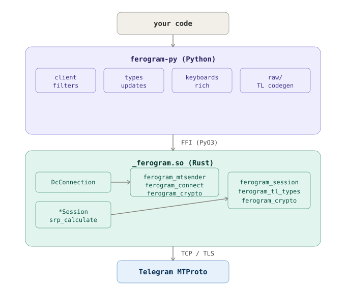

<p align="center">
  
</p>

# ferogram-py

**Elegant, modern and asynchronous Telegram MTProto API framework in Python, for users and bots.**

Powered by a Rust core that handles the heavy parts, networking, encryption, session state, so Python stays out of the way and just gets to be Python.

[](https://pypi.org/project/ferogram/)
[](https://pypi.org/project/ferogram/)
[](#license)
[](./FEATURES.md)
[](https://t.me/FerogramChat)

---

## Why ferogram-py?

Most of what makes an MTProto client slow has nothing to do with your bot logic. It's parsing, encrypting, and pushing bytes over a socket fast enough to keep up with updates. ferogram-py hands all of that to Rust and keeps the surface you actually write against, handlers, filters, keyboards, in plain, readable Python.

The result is a client that feels light to write and doesn't fall over under load. You get async/await everywhere, a proper FSM for conversation flows, raw API access when you need to drop down a level, and a session layer that won't block your event loop doing disk I/O.

It's still young. But the core is solid, actively maintained, and built by someone who uses it every day, not a weekend project left to rot.

> Full API reference: [FEATURES.md](./FEATURES.md)

---

## Install

```bash
pip install ferogram
```

Wheels ship prebuilt for Linux (x86_64, aarch64), macOS (x86_64, arm64), Windows (x86_64), and Android/Termux (aarch64, x86_64). `pip install ferogram` grabs the right one on its own.

<details>
<summary>Building from source</summary>

```bash
make dev      # editable install into .venv (builds the Rust extension)
make build    # release wheel for this machine
make codegen  # regenerate TL code without a Rust rebuild
make test     # run tests
make clean    # wipe .venv, target, dist, generated/
```

On Termux: `pkg install rust clang python` first.
Rust-only change, don't want to wait on codegen: `FEROGRAM_SKIP_CODEGEN=1 maturin develop`

</details>

---

## Quick start

**Bot:**

```python
from ferogram import Client, filters

app = Client("mybot", api_id=0, api_hash="", bot_token="123:TOKEN")

@app.on_message(filters.command("start"))
async def start(client, message):
    await message.reply("Hello!")

app.run()
```

**Userbot:**

```python
import asyncio
from ferogram import Client

app = Client("myaccount", api_id=0, api_hash="", phone="+1234567890")

async def main():
    async with app as client:
        await client.send_message("me", "logged in")

asyncio.run(main())
```

Credentials also work from env vars: `API_ID`, `API_HASH`, `BOT_TOKEN`.

## Logging

```python
import ferogram.logging as fero_log

fero_log.setup()           # INFO to stderr
fero_log.setup(level=10)   # DEBUG
```

## Architecture



The compiled extension (`_ferogram.so`) stays deliberately small: networking, encryption, session storage, and MTProto internals live in Rust. Everything you touch day to day, the client, handlers, filters, is plain Python and can change without a recompile.

---

## License

This project is dual-licensed under:

- MIT License
- Apache License 2.0

You may choose either license.

You are free to use, modify, and distribute this software, including for commercial use, provided the original license and copyright notice are included.

See `LICENSE-MIT` and `LICENSE-APACHE` for full details.

---

## Developer

Developed by [Ankit Chaubey](https://github.com/ankit-chaubey)

Don't forget to explore the Rust engine powering ferogram-py: [ferogram](https://github.com/ankit-chaubey/ferogram). Thanks for being part of the journey.

Join the ferogram community! Questions, discussions, and feedback are always welcome. As the project grows, we'll eventually split Python and Rust discussions into dedicated spaces.

 - Channel (releases & announcements):  [@Ferogram](https://t.me/Ferogram)

 - (questions & discussion): [@FerogramChat](https://t.me/FerogramChat)
